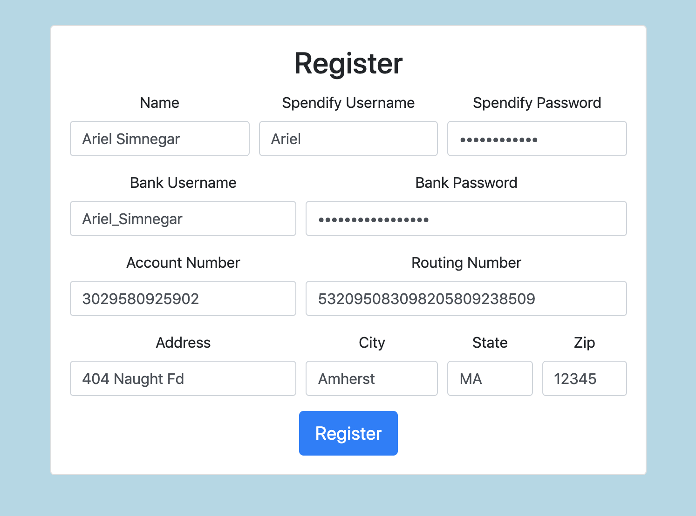
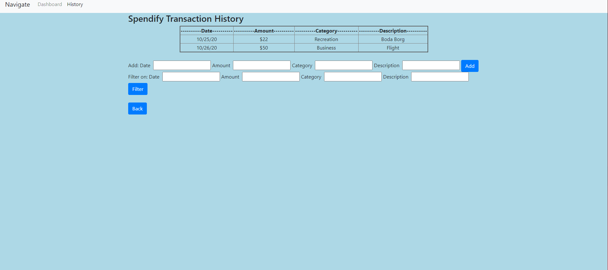

# Software Stonks

## Spendify

### Overview

Spendify is an application that uses analytics of its users' transaction histories to provide detailed feedback on constructive spending habits and practices. Spendify is innovative because it allows users to edit their transaction histories at will, enabling users to record cash transactions that other financial applications cannot track.

### Team Members
 - Alfred Joseph ([josephalfred7](https://github.com/josephalfred7))
 - Ariel Simnegar ([ariel-simnegar](https://github.com/ariel-simnegar))
 - Eric Trimble ([ETrimbs](https://github.com/ETrimbs))

### User Interface

#### Registration

Registers a new user for Spendify.



#### Login

Logs a user into Spendify.


#### Adding and Filtering Transaction History Entries

Enables users to view their transaction histories, filter them by amount, date, category, and description, and add new entries.



### APIs

#### Login API

##### Register User
```
/registerUser
```

This command adds the given user's identifying information to the database:
 - Username
 - Password
 - Real Name
 - Address
 - Bank Username
 - Bank Password
 - Account Number
 - Routing Number

If an entry with the given username already exists, the command does not add the information and returns an error object. Clicking the "Register" button in the Registration UI calls the `/registerUser` API.

**Example**:
```javascript
fetch('/registerUser', {
    method: 'POST',
    headers: {
        'Content-Type': 'application/json;charset=utf-8'
    },
    body: JSON.stringify({
        realname: 'Emery Berger',
        username: 'eberger',
        password: 'i_heart_326',
        bankUsername: 'eberger',
        bankPassword: 'givem3money',
        accountNumber: '0123456',
        routingNumberEl: '01234567890',
        address: '404 Naught Fd.',
        city: 'UMassville',
        state: 'MA',
        zip: '01234'
    })
});
```

##### Login User
```
/loginUser
```

This command takes a username-password pair and returns the user's identifying information. If the username-password pair is not found in the database, the command returns an error object. Clicking the "Login" button in the Login UI calls the `/loginUser` API.

**Example**:
```javascript
fetch('/loginUser', {
    method: 'POST',
    headers: {
        'Content-Type': 'application/json;charset=utf-8'
    },
    body: JSON.stringify({
        username: 'eberger',
        password: 'i_heart_326'
    })
});
```

#### API for Transaction History Entries

##### Add Entry to Transaction History
```
/addEntry
```
This command adds an entry to the user's transaction history in the database.

**Example**:
```javascript
fetch("/addEntry", {
    method: 'POST',
    headers: {
        "Content-Type": "application/json"
    },
    body: JSON.stringify({date:"10/25/20", amount: "22", category: "recreation", description: "Boda Borg"})
});
```

##### Display and Filter Transaction History
```
/historyEntries
```
This command takes filters for transaction amounts, dates, categories, and descriptions and returns the subset of the user's transaction history that matches the given filters (or the entire history if no filters were requested).

**Example**:
```javascript
fetch('/historyEntries', {
    method: 'POST',
    headers: {
        'Content-Type': 'application/json;charset=utf-8'
    },
    body: JSON.stringify({date: '2020-05-10', category: 'Recreation'})
});
```

### Database

<pre>
users  
+---------------+----------+--------------------------------+  
|    Column     | Datatype |          Description           |  
+---------------+----------+--------------------------------+  
| username      | String   | the user username              |  
| salt          | String   | the user password salt         |
| hash          | String   | the user password hash
| realname      | String   | the user's real name           |  
| address       | String   | the user's address             |  
| accountNumber | integer  | the user's bank account number |  
| routingNumber | integer  | the user's bank routing number |  
| bankUsername  | String   | the user's bank username       |  
| bankPassword  | String   | the user's bank password       |  
+---------------+----------+--------------------------------+  
  
history  
+-------------+----------+-------------------------------------------------------+
|   Column    | Datatype |                      Description                      |
+-------------+----------+-------------------------------------------------------+
| username    | String   | user's username                                       |
| date        | String   | the date of transaction                               |
| amount      | integer  | the dollar amount of transaction                      |
| category    | String   | what category of spending the transaction falls under |
| description | String   | description of what the transaction was               |
+-------------+----------+-------------------------------------------------------+
</pre>

### URL Routes/Mappings

 - `/` Logs users in
 - `/register.html` Registers users
 - `/dashboard.html` Provides users feedback based on transaction history
 - `/history.html` Provides transaction history adding and filtering
 - `/income.html` Provides income analytics
 - `/help.html` Explains the purpose of Spendify

### Authentication/Authorization

When a user registers a username and password, the password is converted to the salt and hash which are stored in the database. (The password itself is not stored.) When a user attempts to login with a username and password, the password checked with the salt and hash in the database to see if it matches. If the password checks out, the user is logged in and can access their dashboard and transaction history UIs.

### Division of Labor

#### Alfred Joseph
 - Worked with Ariel to create all wireframes other than income
 - Wrote the starting code for `login.html`, `register.html`, and `help.html`
 - Created API to read and write to transaction history and integrated API with frontend
 - Took screenshots and write entries for transaction history API description in `milestone2.md`
 - Migrated backend from reading/writing to local file `database.json` to a PostgreSQL database
 - Enabled Heroku releases to read/write to their own PostgreSQL databases linked to by environment variables
 - Added `pg-promise` dependency to `package.json`
 - Secured user login by saving password salt and hashes instead of plaintext with Ariel and Eric
 - Wrote database implementation in `milestone3.md`
 
#### Ariel Simnegar
 - Worked with Alfred to create all wireframes other than income
 - Wrote the starting code for `dashboard.html` and `history.html`
 - Have `server/index.js` run HTTP server
 - Created login and registration API and integrated with frontend
 - Added data validation for frontend login and registration
 - Rewrote backend for transaction history filtering API and integrated with frontend
 - Created `setup.md`
 - Took screenshots and wrote entries for login and registration API in `milestone2.md`
 - Wrote entry for filtering API and breakdown of division of labor in `milestone2.md`
 - First deployed app to Heroku
 - Used the HTML Canvas API for visualizations of each user's transaction history
 - Created a donut chart and legend showing each user their spending by category
 - Created a bar chart showing each user's monthly spending for the past year
 - Enabled Spendify suggestions to automatically update in response to transaction history changes
 - Used a `secrets.json` file to hide database username and password from GitHub
 - Wrote breakdown of division of labor in `milestone3.md`
 - Secured user login by saving password salt and hashes instead of plaintext with Alfred and Eric
 - Created and began writing `final.md`

#### Eric Trimble
 - Created the income wireframe and `income.html`
 - Wrote `ideas.md` and contributed to `milestone1.md`
 - Write get API endpoint for history in `server/index.js`
 - Enabled users to filter transactions by amount, date, category, and description
 - Secured user login by saving password salt and hashes instead of plaintext with Alfred and Ariel
 - Prevented users from viewing each other's transaction histories
 - Debugged transaction history API endpoint errors associated with the above change

### Conclusion

Through our design of Spendify, we learned how to create vibrant webpages with Bootstrap, define requirements with Node, create sophisticated databases with MongoDB and PostgreSQL, allow secure logins with MiniCrypt, draw informative data graphics with HTML Canvas, create HTTP servers with express.js, and much more. We encountered many difficulties between debugging the JavaScript we wrote for our frontend and backend, ensuring our database retained the information we needed, and getting our HTTP servers running, but we worked together to complete Spendify in spite of those setbacks. Having a more in-depth knowledge of HTML, CSS, SQL, and JavaScript would have significantly improved our pace and minimized our debugging time. Despite our difficulties, we're proud to have made Spendify a reality.

[Link to hosted application!](https://guarded-cliffs-22166.herokuapp.com/)
