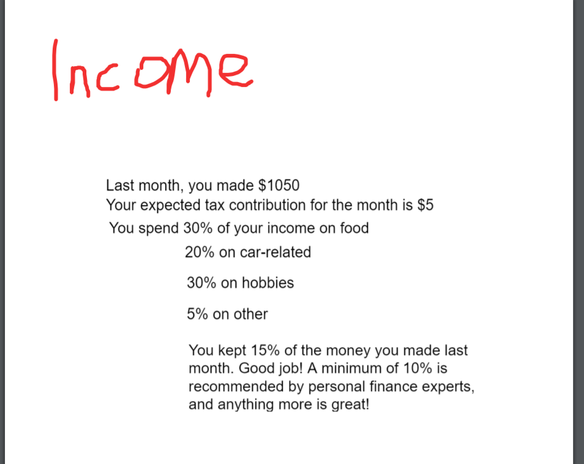
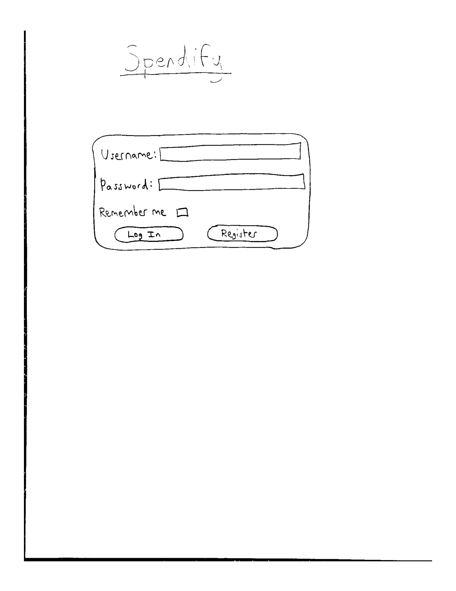
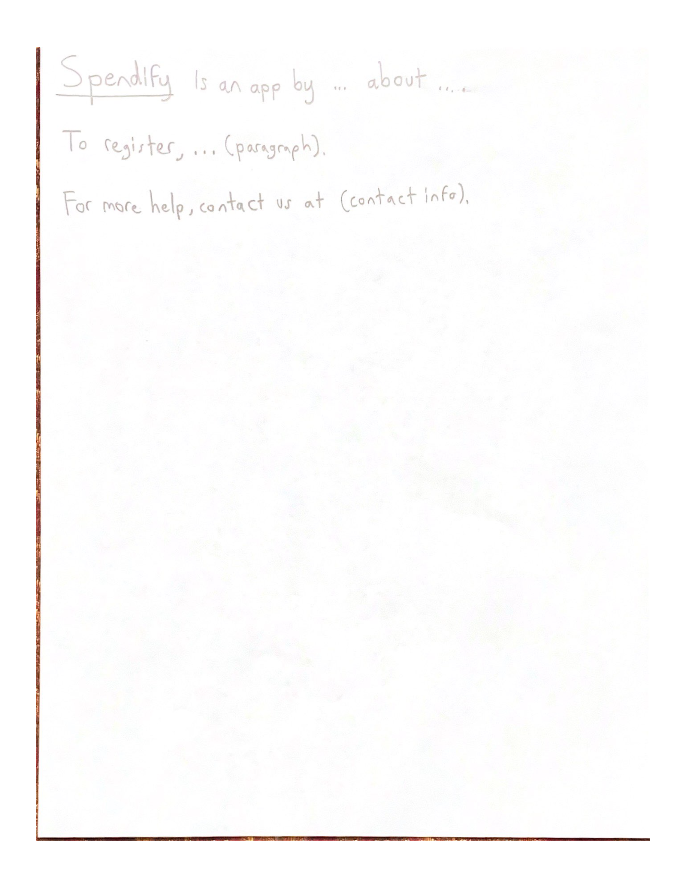
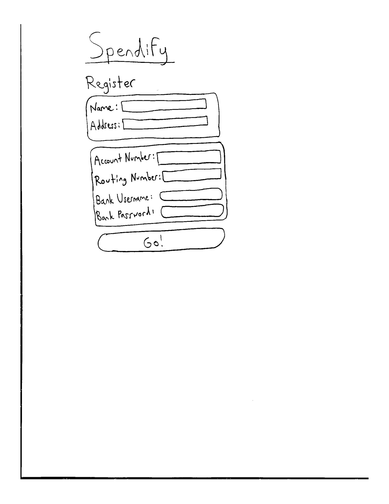
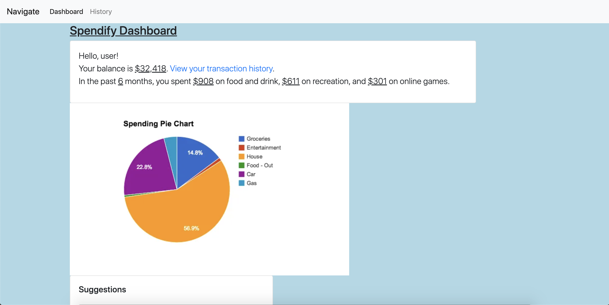
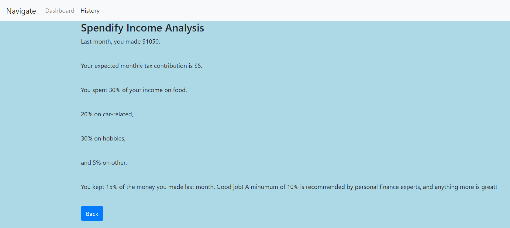
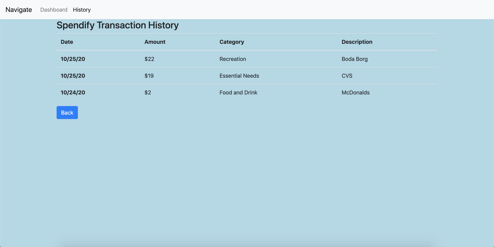
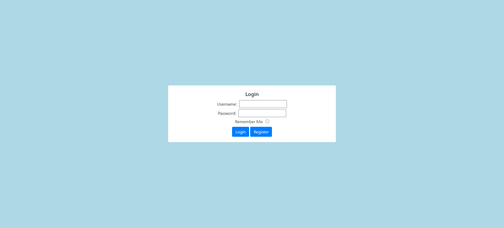
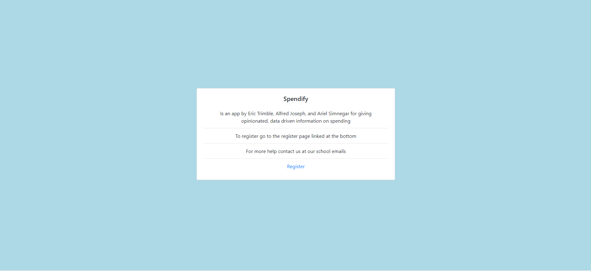
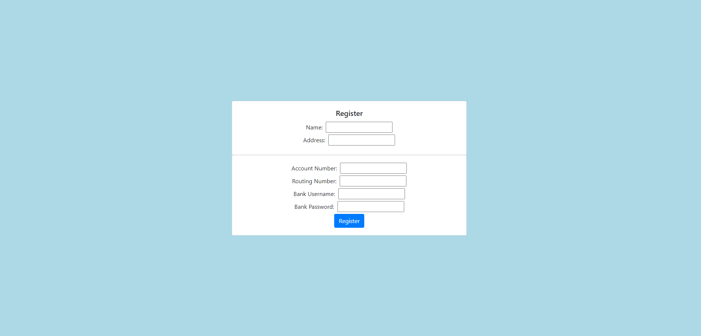

## Data Interactions
Users will input data manually and/or pull data from their accounts. The app will process and show data on certain html pages

## Dashboard

The dashboard will show the results of Spendify's analytics on user data. These results will include observations, suggestions, visual displays (charts, graphs, etc), and much more!

## Income Analysis

The income analysis page will show data about how much of a user's income they are keeping each month. The recommended minimum savings is 10% of earned income. It will display a recommendation based on the calculated savings.

## Transaction History

On this page, users will easily be able to view their transaction histories and understand how the application classifies their various transactions.

## Login

On this page users will be able to log in to their account

## Help Page

On this page users will get an overview of what the site is for as well as links to registration and contact information

## Register Page

On this page users will be able to register for this service by adding their name and their bank account information

# Webpages

## Dashboard

## Income Analysis

## Transaction History

## Login

## Help Page

## Register Page

# Breakdown of Division of Labor

Eric Trimble - helped with this file, created the income wireframe, html, and images. Helped debug some html/css interactions including the background color and overriding bootstrap styles. Also, created ideas.md
Alfred Joseph - helped create all the wireframes other than income. Created the html for login, register, and help. Added parts to milestone1.md
Ariel Simnegar - helped create all the wireframes other than income. Created the html for the dashboard and for the transaction history.
